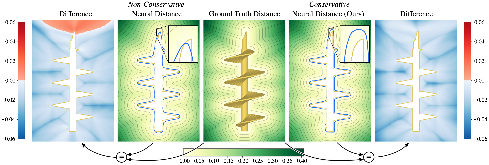

<br><br><br>

# Strictly Conservative Neural Distance Fields

### Eurographics Symposium on Geometry Processing 2026

Conservative Neural Distance Fields is a method for converting 3D shapes into neural unsigned or signed distance fields (SDFs) with guaranteed conservativeness. The resulting distance field never overestimates the true distance, and its zero-level set forms a bounding volume of the input shape. The method makes use of neural network architectures that ensure Lipschitz continuity by design in combination with a novel tailored training data selection scheme and constrained training strategy.

Conservative Neural Distance Fields is described in more detail in the publication below.

# Citation

If you find this code useful, please consider citing our paper.
```
@article{StrictlyConservativeNeuralDistanceFields,
author = {Ludwig, I. and Campen, M.},
title = {Strictly Conservative Neural Distance Fields},
journal = {Computer Graphics Forum},
volume = {45},
number = {5},
year = {2026}
}
```

# Getting Started

### Install dependencies
The code was tested on Ubuntu and Mac (Apple Silicon)
1. Prepare CMake and build essentials.
```bash
apt install cmake 
sudo apt-get update && apt-get install build-essential
```
2. Install tetgen
2.1 Download tetgen 1.6.0 from  https://wias-berlin.de/software/ and put the folder in the root repository.
2.2 Rename the tetgen folder to tetgen1.6.0 if it is not already the case.
```bash
cd tetgen1.6.0 
mkdir build
cd build
cmake ..
make
```
3. Install Python 3.13
Linux:
```bash
sudo add-apt-repository ppa:deadsnakes/ppa
sudo apt update
sudo apt install python3.13 python3.13-venv python3.13-dev
```
Mac:
```bash
brew install python@3.13
```

4. 1. Create a virtual environment in the root directory and activate it.
```bash
python3.13 -m venv .venv 
source .venv/bin/activate
```

5. Install dependencies
```bash
pip install torch torchvision
pip install jupyter
pip install matplotlib
pip install mouette
pip install miniball
pip install scikit-image
pip install deel-torchlip
pip install libigl
pip install tqdm
pip install pyvista
pip install trame trame-vtk trame-vuetify -q
```

### Create Neural Distance Field
1. Open notebook
Open templates/training_template.ipynb
2. Set Shape
Replace drill with another shape of your choice (as found in meshes)
3. Modify settings
To reduce the runtime, one might reduce `fixed_n_outside_points_train` and `n_test_points` or increase `max_edge_length_tets_in`.
To increase the resolution, one might increase the model size by changing `layer_width_model` and `num_hidden_layer_model`, and increase training time with `epochs_per_lr`. If the model size is saturated, one might also decrease `max_edge_length_tets_in`.
If one is not interested in the distance field, volume excess can be further reduced by setting the `gammas` to zero.
If one wants to improve the absolute distance error further away from the surface, one should increase the `offset` to the desired extent. One might also slightly increase the `gammas` in this case.
4. Run Jupyter notebook
Execute the notebook.

Note that the two-sided SDF option described in the paper is not explicitly included in the code for clarity. It can essentially be replicated by training two one-sided DFs. Feel free to contact us for details.